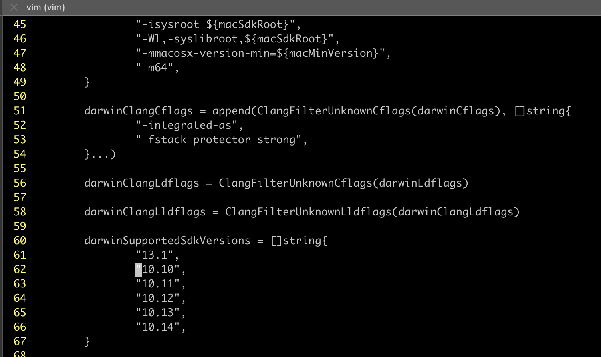

## Compile AOSP in Darwin

AOSP 代码可以编译在 linux 上以及 Mac 上，网上大多数都是 linux 的教程，虽然 Mac 上编译流程没有区别，但是会遇到完全不一样的问题，而且相比 linux， 遇到的问题更多。

### 增加大小写敏感分区

AOSP 的编译要求位于一个大小写敏感的文件系统上，Mac 上默认的 APFS 卷宗是大小写不敏感的，因此我们需要创建一个大小写敏感的分区。

1. 打开磁盘管理工具


2. 增加卷宗->记得选择大小写敏感


### 获取源码

别说国内，我用公司的海外专线下载都会概率出现失败 :anguished:, 使用清华源，也从来没有下载成功过，可能是因为限流。
后面查找[资料](https://zhuanlan.zhihu.com/p/27236627794)通过[中科大](https://mirrors.ustc.edu.cn/help/aosp.html)的源，采用两步下载的方式终于成功下载了。

1. 下载 repo 文件
> 这个文件类似于 .git 文件里面的对象，其中包含了大量的更改信息

访问 https://mirrors.ustc.edu.cn/aosp-monthly/ 下载 tar 包。

2. 解压文件到上面创建的大小写敏感分区
> 解压后在目标文件中看不到任何的信息，其实是因为解压的内容在隐藏目录中 '.repo'

```bash
cd /Volumes/workspace/android
tar -xf ~/Downloads/aosp-latest.tar -C . 
```

3. 修改代码源

打开 config 文件，把源修改成中科大源 ```url = git://mirrors.ustc.edu.cn/aosp/platform/manifest```

```bash
vim .repo/manifests.git/config
```


4. 安装 repo 工具

```bash
curl -sSL 'https://gerrit-googlesource.proxy.ustclug.org/git-repo/+/main/repo?format=TEXT' | base64 -d > ./repo
chmod a+x ~/bin/repo
```

4. 同步代码
> 大概耗时一个小时

```bash
cd /Volumes/workspace/android
repo init -b android-10.0.0_r41
repo sync  # 别开启多个线程，大家公平使用
```

### 开始编译

```bash
source build/envsetup.sh
lunch aosp_x86_64-eng
make -j16
```

### 启动模拟器

```
emulator -verbose -cores 4 -show-kernel
```


### 编译踩坑记录

1. Could not find a supported mac sdk

这个问题是因为我们编译的 android10 支持 macos-sdk 版本比较旧，如果我们系统版本比较高的话，就会报错。

解决方案：打开 build/soong/cc/config/x86_darwin_host.go 文件，在 drawinSupportedSdkVersions 列表中增加自己的 os 版本。我的是 13.1.

> :dart: 如何查看自己的 macos-sdk 版本
> ```bash ls /Applications/Xcode.app/Contents/Developer/Platforms/MacOSX.platform/Developer/SDKs ```



2. sprintf is deprecated

这个问题是因为 sprintf 被废弃了，我们要修改成 snprintf. 这个问题会在数个文件中出现，一次修改即可。

需要注意下面这个文件的修改，buffsize 应该是 ```dest_len - used```, 而不是4，我之前把这个写成4，在后续的步骤中出现编码错误，导致我排查了八个小时。


3. use of undefined identifier 'PAGE_SIZE'

原因是高版本 sdk 可能一处了某些宏定义，这里需要我们手动增加一下。

修复方法：打开 ```system/core/base/include/android-base/cmsg.h``` 文件，在里面增加宏定义。

```c
#ifndef PAGE_SIZE
#define PAGE_SIZE (size_t)(sysconf(_SC_PAGESIZE))
#endif
```

4. sepolicy_test 失败

这个不知道啥原因，在网上找到了解决办法，打开 ```system/sepolicy/tests/Android.bp``` 文件，去除 ```stl: "libc++_static",```

5. mk_combined_img.py  error

这个脚本需要使用 python2 来进行解析，如果你没有python2，将会报错你需要安装 Python2，这个本身不好找了，需要去网上下载 python2 安装包手动安装 [地址](https://www.python.org/downloads/release/python-2718/)。

> 你可能想为什么我不修改语法格式，使用 python3 来解析呢，我做了，可以编译过，但是生成的镜像格式有错误，模拟器打开黑屏。


